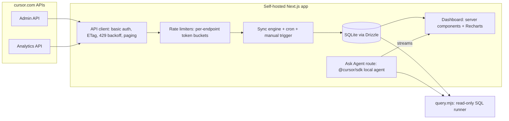
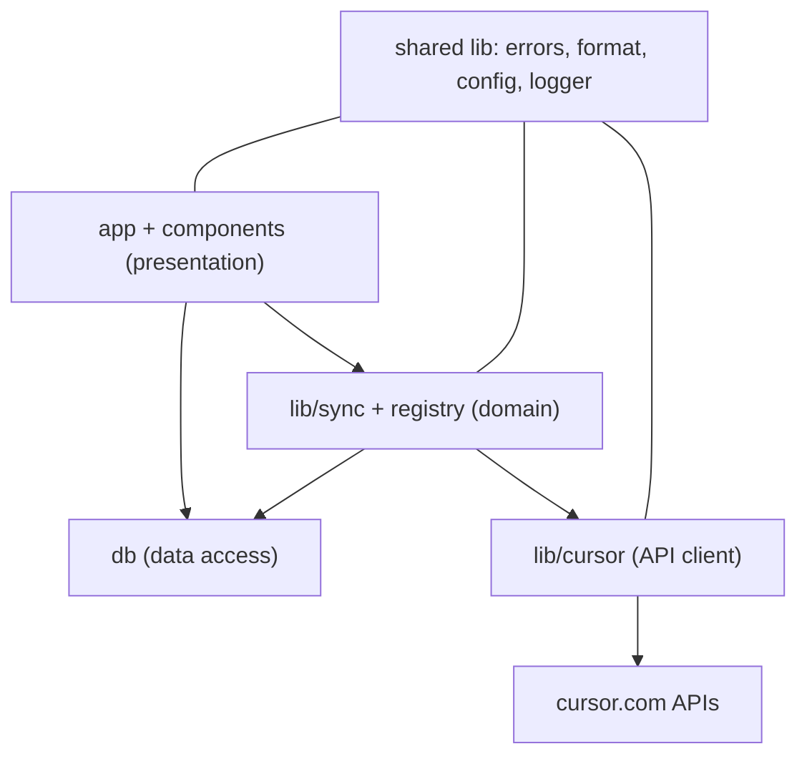
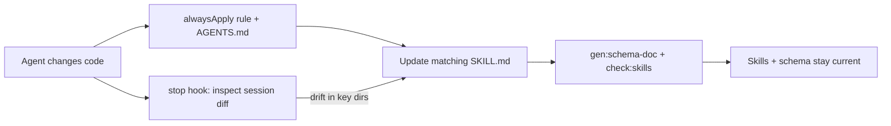

# Cursor Lens

A self-hosted, single-team app that pulls every requested Admin API + all Analytics API endpoints into a local SQLite cache, renders a polished read-only analytics dashboard, and lets an embedded Cursor SDK agent answer questions / build custom reports against that data.

## Architecture

## Stack and key decisions

- TypeScript + Next.js (App Router), Tailwind CSS + shadcn/ui, Recharts for charts.
- SQLite via Drizzle ORM on `better-sqlite3` (WAL mode). File-based = trivially deployable and directly queryable by the local agent.
- `@cursor/sdk` (TypeScript) local runtime for the Ask-Agent feature.
- Data pages are React Server Components that read SQLite directly; only sync, chat, and ad-hoc queries use API routes.
- Centralized design tokens + a reusable component library (including one chart wrapper) so the UI is consistent and re-themeable.
- A declarative metric/endpoint registry so new metrics/endpoints wire into sync, charts, and the agent with minimal code.
- Agent-facing skills in `.cursor/skills/` keep future agents productive and are kept current automatically (see below).

### Two API keys (important nuance)

- Admin/Analytics key: Basic auth (`-u KEY:`), `admin:*` scope, used for all data ingestion.
- `CURSOR_API_KEY` (user or team service-account key): required by the SDK agent. Per the SDK, team Admin API keys are NOT accepted, so the agent needs its own key. Both are entered in Settings, stored encrypted; the agent key can be omitted (dashboards still work, chat disabled).
- SDK local runtime spawns Cursor's agent on the host, so full chat works best running the app on a machine with Cursor's agent runtime (documented; Docker note included).

## Robust architecture for agent-driven development

Built so agents can change it safely: strong boundaries, validation at every edge, tests, and a single green-gate that defines "done".

Layered boundaries (dependencies flow one way; enforced by dependency-cruiser):

- Type safety + boundary validation: `strict` TypeScript; Zod schemas validate every external API response, every API-route input, and env/config ([src/lib/config.ts](src/lib/config.ts)); domain types are `z.infer` of those schemas (one source of truth), DB types come from Drizzle.
- Error handling + resilience: one typed error taxonomy in [src/lib/errors.ts](src/lib/errors.ts) (auth, rate-limit, validation, transport); each sync job is isolated and resumable (one endpoint failing never aborts the run), with retries/backoff and transactional, idempotent upserts.
- Observability: structured logging (`pino`) + a `sync_runs` table (per-endpoint status, rows, duration, error) surfaced in the UI, so failures are diagnosable by humans and by the embedded agent.
- Tests + quality gate: Vitest unit tests (client rate-limit/backoff/pagination/ETag, sync transforms, formatters, registry) and `msw` integration tests using fixtures built from the documented API responses. One command `npm run verify` runs typecheck + lint + boundary check + tests + `check:skills` + SCHEMA drift; GitHub Actions runs it on every push; husky/lint-staged runs the fast subset pre-commit.
- Determinism: committed lockfile, pinned Node (`.nvmrc` + `engines`), and a mock/offline mode (fixtures) so agents can build and run the full suite without a live key.
- Definition of done (every change): `npm run verify` is green, the matching skill + `SCHEMA.md` are updated, and new behavior ships with tests. The `stop` hook nudges this.

## Extensible design system ([src/design](src/design), [src/components](src/components))

- Single token layer: CSS variables + Tailwind theme for color, spacing, type scale, radii, shadow, and a fixed chart palette; light/dark via `data-theme`. Re-theming = edit tokens, never components (Cursor brand palette as the optional default theme).
- Primitives via shadcn/ui: `Button`, `Card`, `Table`, `Tabs`, `Badge`, `Input`, `Select`, `Dialog`, `Tooltip`, `Skeleton`.
- Domain components are the shared layer every page and future agent builds on: `KpiCard`, `ChartCard`, `MetricChart` (one Recharts wrapper for line/area/bar/stacked with shared axes, tooltips, and formatters), `DataTable` (sort/search/paginate/export), `DateRangePicker`, `TrendBadge`, `EmptyState`, `SyncStatusBadge`.
- Shared formatters in [src/lib/format.ts](src/lib/format.ts): `formatCents` (cents to $), `formatNumber`, `formatPercent`, `formatDate` so units stay consistent everywhere.
- Metric/endpoint registry in [src/lib/registry.ts](src/lib/registry.ts): each metric is a declarative entry (id, source endpoint, table, rate-limit group, default chart, formatter, page). Adding a metric = one registry entry + a Drizzle table/migration; sync, charts, and the agent's schema doc all read the registry. This is the extensibility backbone that keeps the app workable for future agents.
- Optional `/components` gallery route renders every component in loading/empty/error/populated states as living documentation.

## Data model (SQLite tables in [src/db/schema.ts](src/db/schema.ts))

- Admin: `team_members`, `audit_logs`, `daily_usage` (per user/day), `spend` (per-user cycle snapshot incl. `monthlyLimitDollars` + `hardLimitOverrideDollars` = the "user spend limits" read view), `usage_events` (granular: model, kind, maxMode, token usage, `chargedCents`, headless/service-account).
- Analytics team-level: `agent_edits`, `tabs`, `dau`, `client_versions`, `models` (normalized to date/model/messages/users rows), `top_file_extensions`, `mcp`, `commands`, `plans`, `skills`, `ask_mode`, `conversation_insights`, `leaderboard`, `bugbot`.
- Analytics by-user: per-user variants for the 10 by-user metrics (keyed email+date).
- Ops: `sync_state` (per-endpoint watermark, last run, stored ETag), `settings` (encrypted keys + config), `saved_reports`.

## Ingestion and rate-limit engine ([src/lib/cursor](src/lib/cursor), [src/lib/sync](src/lib/sync))

- Token-bucket limiters (`bottleneck`) per endpoint group: Admin 20/min, Analytics team 100/min, by-user 50/min, conversation-insights 20/min.
- 429 handling honoring `Retry-After` / `X-RateLimit-Reset` with exponential backoff; ETag `If-None-Match` to skip unchanged data (304).
- Auto-chunk 30-day-max windows (audit-logs, daily-usage-data, filtered-usage-events, analytics) and follow pagination to completion.
- Hourly poll guard for `daily-usage-data` and `filtered-usage-events` (data is hourly-aggregated).
- Incremental upserts via watermarks; full-backfill option. Triggered by node-cron (boot via [src/instrumentation.ts](src/instrumentation.ts)) + a "Sync now" button hitting [src/app/api/sync/route.ts](src/app/api/sync/route.ts).

## Dashboard pages (beautiful, read-only)

- Overview: KPI cards (DAU trend, cycle spend, total requests, lines accepted, acceptance rate) + sparklines.
- Adoption, Model usage, Spend, Productivity, Feature adoption (MCP/commands/plans/skills/ask-mode/conversation-insights/bugbot), Members, Audit logs.

## Ask Agent + custom reports ([src/app/api/chat/route.ts](src/app/api/chat/route.ts), [src/app/ask/page.tsx](src/app/ask/page.tsx))

- `Agent.create` with `local.cwd` = repo root (inline-only setting sources) so the agent can read the `agent-data-queries` skill, plus a system prompt that injects the generated `data/SCHEMA.md` and points at `data/query.mjs` (opens `data/analytics.db` read-only, prints JSON/markdown). The agent runs SQL to answer questions like "all users who used Opus in the past 90 days" (sourced from `usage_events`/by-user `models`).
- Responses streamed to the chat UI via `run.stream()`; results exportable to CSV and savable as reports. Read-only DB handle prevents mutations.

## Agent-facing skills + self-maintenance ([.cursor/skills](.cursor/skills), [.cursor/rules](.cursor/rules), [AGENTS.md](AGENTS.md))

Project skills are checked into the repo so any future agent auto-discovers them, and keeping them current is part of every change's definition of done (enforced by an always-applied rule and a stop hook).

Seeded skills (each maps to a code area):

- `architecture-overview`: codebase map + data flow + links to the other skills (auto-invoked entry point).
- `design-system`: tokens, components, `MetricChart`, formatters; how to add a component/chart (reuse tokens, never hardcode).
- `data-model-and-migrations`: Drizzle conventions, migration workflow, upsert/watermark patterns, how to regenerate `data/SCHEMA.md`.
- `adding-a-cursor-endpoint`: checklist (client wrapper + rate-limit group + types + registry entry + table + migration + sync job).
- `adding-a-dashboard-page`: build a page/metric from the registry + components.
- `sync-and-rate-limits`: limiter groups, backoff, ETag, 30-day chunking, hourly guard.
- `agent-data-queries`: how the embedded SDK agent queries the DB (`data/query.mjs`, `data/SCHEMA.md`); this skill's content is the single source injected into the embedded agent's system prompt.
- `maintaining-skills` (meta-skill): the skill-to-code-area map and the update workflow.

What makes them dynamic:

- Rule [.cursor/rules/keep-skills-current.mdc](.cursor/rules/keep-skills-current.mdc) (`alwaysApply: true`, <50 lines): read `.cursor/skills/` before non-trivial work; update the matching skill + `SCHEMA.md` whenever behavior or conventions change.
- [AGENTS.md](AGENTS.md): repo entry point pointing at the skills and the skill map.
- Hook [.cursor/hooks.json](.cursor/hooks.json): a `stop` prompt hook that, if files under `src/lib/cursor`, `src/db`, `src/components`, or `src/design` changed this session, asks the agent to update the matching skill, run the gen scripts, and confirm `npm run verify` is green before finishing (fail-open).
- Scripts: `npm run gen:schema-doc` (rebuild `data/SCHEMA.md` from the Drizzle schema so the embedded agent stays current) and `npm run check:skills` (flag skills referencing files that no longer exist).

## Deployment

- `npm install && npm run db:migrate && npm run build && npm start`; `.env.example`, Dockerfile + docker-compose (with the agent-runtime note); keys encrypted at rest, `data/` gitignored. README with setup + prerequisites.

## Notes / risks

- Analytics API + several Admin endpoints are Enterprise-only; non-enterprise keys will get 401/403 on those (handled gracefully, surfaced in sync status).
- Agent shell access is constrained to a read-only SQLite connection in the data dir.
- External API responses are Zod-validated, so upstream schema changes surface as clear validation errors instead of silent data corruption.
- Mock/offline mode lets agents develop and run the full test suite without a live Cursor key.
